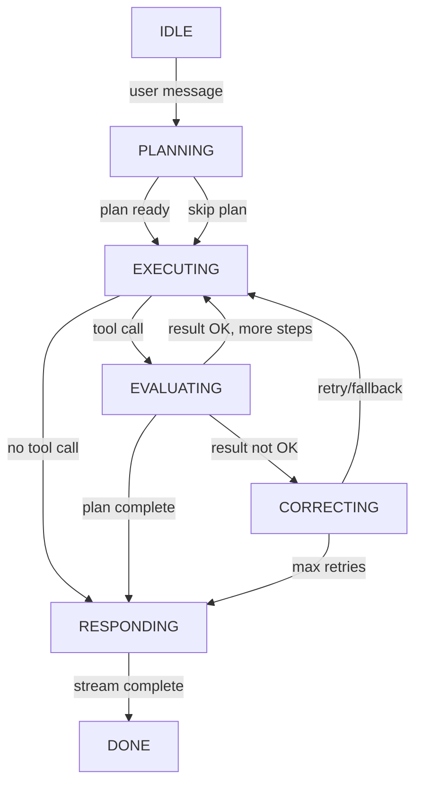

# Agent Loop — State Machine Design

## Summary

Nâng cấp ReAct loop hiện tại thành State Machine orchestrator với Planning phase, Evaluation phase, và Self-correction mechanism.

## Current Problem

`ollama.provider.ts` (254 dòng) ôm đồm quá nhiều responsibility:
- Tool executor registration (không nên ở provider)
- ReAct loop orchestration (không nên ở provider)
- LLM stream call (nên ở lại)
- SSE event formatting (không nên ở provider)
- Session persistence (không nên ở provider)

## Architecture

```
AgentController
  └─ AgentService — resolve provider, build context, orchestrate
       └─ AgentLoopService (NEW) — state machine orchestrator
            ├─ LLMControllerService (NEW) — provider-agnostic LLM control
            │    ├─ ollama.provider.ts (SIMPLIFIED) — chỉ raw stream
            │    ├─ openai.provider.ts (future)
            │    └─ ...
            ├─ Tool executors (giữ nguyên)
            └─ SSE event stream → HTTP Response
```

## State Machine

### States

| State | Mô tả | Transition vào | Transition ra |
|---|---|---|---|
| `PLANNING` | LLM quyết định có cần plan không, sinh step list | user message | EXECUTING |
| `EXECUTING` | Stream LLM, collect tokens + tool_calls | PLANNING / EVALUATING / CORRECTING | EVALUATING / RESPONDING |
| `EVALUATING` | Kiểm tra tool result quality | EXECUTING | EXECUTING / CORRECTING / RESPONDING |
| `CORRECTING` | Retry 2 lần → thử tool khác → hỏi user | EVALUATING | EXECUTING / RESPONDING |
| `RESPONDING` | Tổng hợp response cuối | EXECUTING / EVALUATING / CORRECTING | DONE |
| `DONE` | Kết thúc stream | RESPONDING / CORRECTING | — |

### Transitions



## Self-Correction Logic

Khi tool call thất bại hoặc trả về kết quả không đạt yêu cầu:

1. **Retry** — Tự động retry tối đa 2 lần với args khác
2. **Tool fallback** — Nếu vẫn fail, thử tool khác có chức năng tương đương
3. **Ask user** — Nếu tất cả đều fail, dừng lại và hỏi user hướng xử lý

### Evaluation criteria

- Tool error/exception → CORRECTING
- Tool returns empty/null/error → CORRECTING
- search_knowledge returns 0 results → CORRECTING (retry with different query)
- Tool returns expected data → EXECUTING / RESPONDING

## Files Changed

### New files

| File | Responsibility |
|---|---|
| `src/agent/services/agent-loop.service.ts` | State machine orchestrator |
| `src/agent/services/agent-loop.service.spec.ts` | Tests |
| `src/agent/services/llm-controller.service.ts` | Provider-agnostic LLM control |
| `src/agent/services/llm-controller.service.spec.ts` | Tests |
| `src/agent/dto/agent-state.enum.ts` | AgentState enum |

### Modified files

| File | Thay đổi |
|---|---|
| `src/agent/providers/ollama.provider.ts` | Simplify: chỉ raw stream, merge LLMCallerService, bỏ loop/tool/SSE/session logic |
| `src/agent/providers/llm-provider.interface.ts` | Simplify interface: chỉ `stream()` method |
| `src/agent/agent.service.ts` | Gọi AgentLoopService thay vì OllamaProvider trực tiếp |
| `src/agent/agent.module.ts` | Register AgentLoopService, LLMControllerService |
| `src/agent/dto/agent-run-state.ts` | Thêm currentState field |

### Removed files

| File | Lý do |
|---|---|
| `src/agent/services/llm-caller.service.ts` | Merge vào simplified ollama.provider.ts |
| `src/agent/services/llm-caller.service.spec.ts` | Không còn cần |

## Implementation Order

1. Tạo `AgentState` enum
2. Simplify `LLMProvider` interface, simplify `ollama.provider.ts` (merge LLMCallerService)
3. Tạo `LLMControllerService` (provider routing, message management)
4. Tạo `AgentLoopService` (state machine)
5. Update `agent.service.ts` để dùng AgentLoopService
6. Update `agent.module.ts`
7. Write tests
8. Remove LLMCallerService + spec cũ

## Testing Strategy

- Unit test từng state transition
- Mock LLM provider để test correction logic
- Test evaluation criteria với known inputs
- Integration test: full loop với mock LLM
